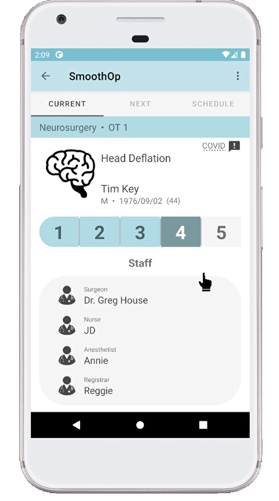
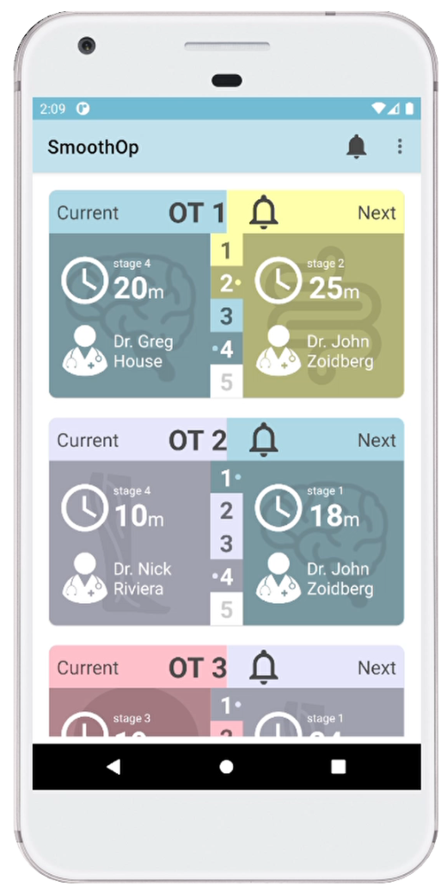

# SmoothOp - App

 
SmoothOp is an app aiming to increase efficiency where it matters most. The COVID-19 pandemic has dramatically increased waiting times in hospitals so maximum efficiency has become paramount.

 With a multitude of fast-moving parts, it's difficult to keep track of what's going on in an operating theatre. SmoothOp can help keep everyone up to date.

## Operation Tracking
  
  
Operations go through a number of stages, from pre-operative prep through to surgery and to post-operation. 

 Think of these stages like your favourite pizza take away. After you order online there's a page giving you updates and notifications when your order moves through to the next stage. This app works off the same idea.

You can track how long an operation has been at a certain stage for at a glance from the home screen. Tapping on an operation theatre's bell will notify you directly of any changes.

Tapping on an operation brings you to a screen showing more information where quick comments can also be sent.

Updating the data is done through a web controller. Operating theatres are already equipped with computers so no extra hardware is needed.
  
### Technology
* Android Studio + Java
* Firebase for communicating database
* Vue.js web app

### Authors
* Tom Moran - App, Database, some web app
* Imalia Gonzalezova - App Login
* Mikhail Dyudlin - Web app
